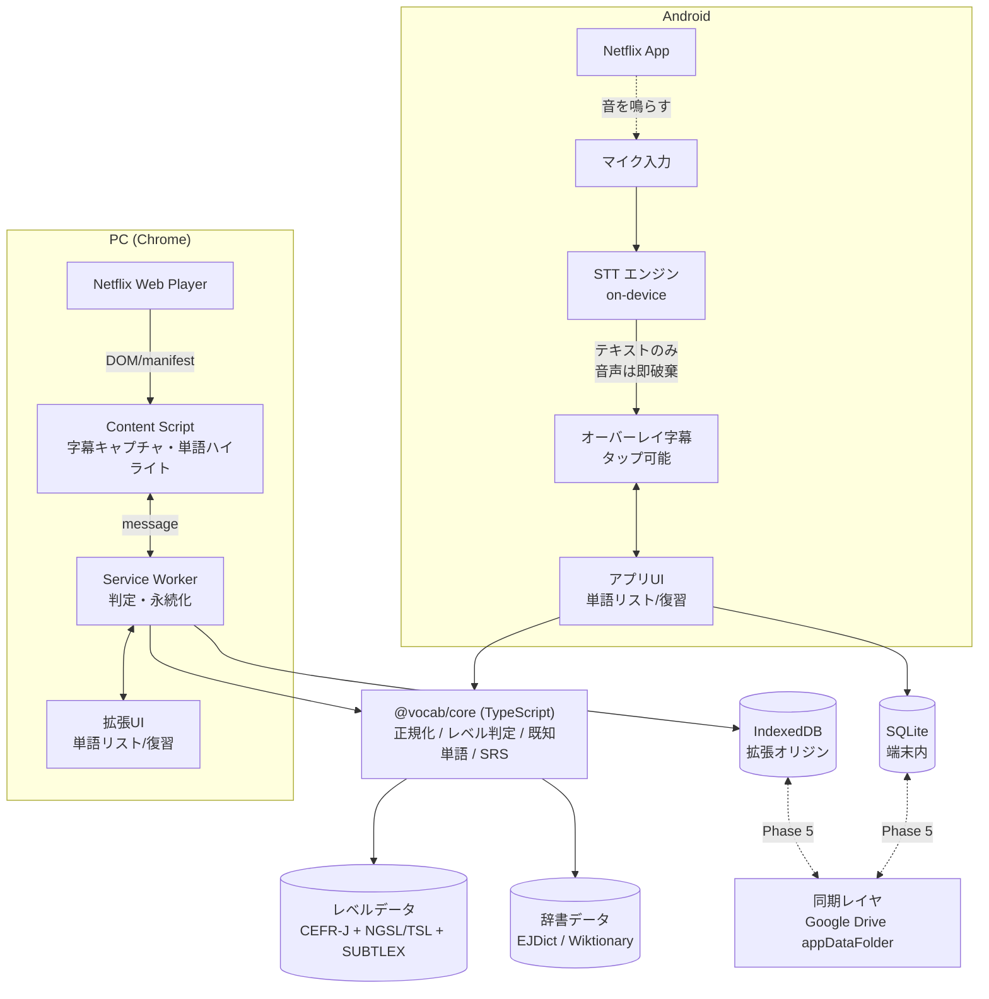
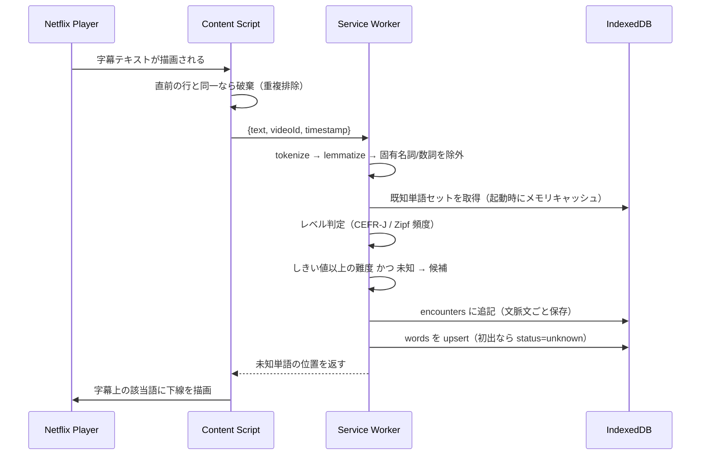
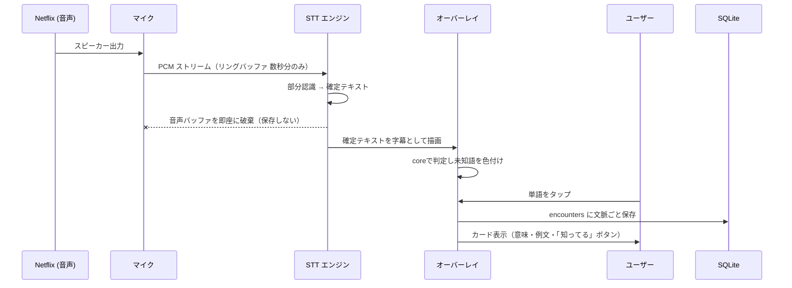
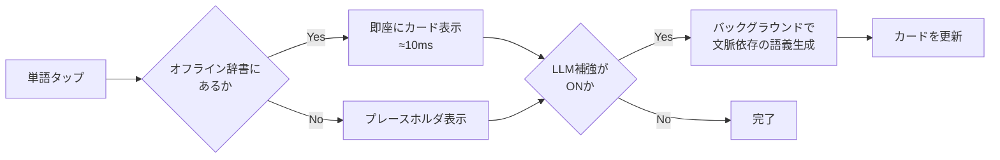

# Netflix 英単語自動収集システム — システム設計書

> 最終更新: 2026-08-10 / ステータス: 設計案（実装前）

---

## 0. 結論サマリ（先に読むところ）

この設計で最も重要な判断は次の3つです。

| # | 判断 | 理由 |
|---|---|---|
| 1 | **コアロジックを純粋な TypeScript パッケージ (`@vocab/core`) に切り出し、PC拡張とモバイルの両方から使う** | レベル判定・既知単語管理は環境に依存しない純関数の集合にできる。ストレージだけをアダプタで差し替える |
| 2 | **モバイルは React Native + ネイティブモジュール（オーバーレイ/STT）** | 上記コアを「移植」ではなく「そのまま import」するため。Kotlin で書き直すと二重メンテになる |
| 3 | **モバイルの音声認識は "best effort" と割り切り、PC版を主・モバイルを従とする** | 後述する技術的制約により、モバイル単独で高精度な字幕取得は原理的に困難。ここを楽観視すると計画が破綻する |

そして、**先に検証すべき最大のリスク**は「Netflix の上に Android オーバーレイが出せるか」と「BGM混じりの映画音声で STT がどれだけ使い物になるか」の2点です。Phase 0 でここを潰します（第12章）。

---

## 1. スコープと前提

### 作るもの

- **PC版**: Chrome 拡張。Netflix Web の字幕を取得し、未知単語を検出・蓄積する
- **モバイル版**: Android アプリ。マイク経由の音声認識で発話をテキスト化し、オーバーレイ字幕として表示、タップで単語カード生成
- **共有コア**: レベル判定・既知単語管理・単語正規化のロジック
- **復習**: 蓄積した未知単語のリスト表示・SRS（間隔反復）・Anki/CSV エクスポート

### 作らないもの（初期スコープ外）

- 動画・音声の保存（**明示的な非目標**。音声はテキスト化した瞬間に破棄）
- 字幕ファイルそのものの保存・再配布
- Netflix 以外のプラットフォーム対応（設計上は差し込めるようにするが実装しない）
- iOS 版（第7.6章で理由を述べます）

### 「Language Reactor と共有」の解釈について

依頼文の「PCの Language Reactor 拡張機能とロジックを共有」は、**サードパーティ製品である Language Reactor 本体のコードに手は入れられない**ため、次のいずれかになります。

- **(A) 自作のPC拡張を作り、そことモバイルでコアを共有する** ← 本設計はこちらを採用
- (B) Language Reactor をそのまま使い、その **エクスポート機能（単語リストの CSV/JSON 出力）** を取り込む口だけ用意する

(B) は Phase 1 の暫定手段としては有効なので、**インポート機能は作ります**（第9.6章）。ただし本命は (A) です。

---

## 2. 全体アーキテクチャ



### レイヤ構成

```
@vocab/core            ... 純粋TS。I/Oを持たない。テストしやすい
  ├─ normalize/        ... トークナイズ、レンマ化、固有名詞除外
  ├─ level/            ... CEFR-J・頻度からの難易度判定
  ├─ vocab/            ... 既知/未知/学習中の状態遷移
  ├─ srs/              ... 間隔反復のスケジューリング
  └─ ports/            ... ストレージ・辞書のインタフェース定義（実装なし）

@vocab/data            ... ビルド時に生成される辞書・レベル辞書（成果物は静的JSON）
@vocab/storage-idb     ... IndexedDB 実装（PC拡張用）
@vocab/storage-sqlite  ... SQLite 実装（モバイル用）
apps/extension         ... Chrome 拡張 (MV3)
apps/mobile            ... React Native (Android)
```

**ポイント**: `@vocab/core` は `ports/` にインタフェースだけ定義し、実装を持ちません。これにより「同じ判定ロジックが PC でもスマホでも1行も違わずに動く」ことが保証され、テストもコアだけで完結します。

---

## 3. データフロー

### 3.1 PC版：字幕1行が未知単語になるまで



**設計上の注意（重要）**: Chrome 拡張の Content Script は **netflix.com のオリジン**で動くため、そこで IndexedDB を開くと「Netflix のデータベース」になってしまいます。永続化は必ず **Service Worker（拡張オリジン）側**で行います。ここを間違えると、Netflix 側のストレージ削除で学習データが消えます。

### 3.2 モバイル版：音から単語カードまで



**プライバシー設計**: 音声は固定長リングバッファ上にのみ存在し、ファイル化・アップロードを一切行いません。オンデバイス STT を既定にすることで、この保証をコードレベルで担保します。

---

## 4. コアロジックの共有（検討事項 1 への回答）

### 4.1 共有できるか → できます。ただし条件付き

レベル判定・既知単語管理は **入力（単語列）と参照データ（レベル辞書・既知単語セット）だけで決まる純関数**なので、環境非依存に書けます。共有を阻む要因は次の2つだけです。

| 阻害要因 | 対策 |
|---|---|
| 言語の違い（TS vs Kotlin） | モバイルを **React Native** にして TS に統一。Kotlin はオーバーレイ・マイク・STT のネイティブモジュールのみ |
| ストレージ API の違い（IndexedDB vs SQLite） | コアは `VocabRepository` インタフェースにのみ依存し、実装を注入する |

### 4.2 ポート定義（コアが要求する契約）

```ts
// @vocab/core/ports/repository.ts
export interface VocabRepository {
  getKnownLemmas(): Promise<Set<string>>;          // 起動時に一括ロード
  getWord(lemma: string): Promise<WordRecord | null>;
  upsertWord(w: WordRecord): Promise<void>;
  addEncounter(e: EncounterRecord): Promise<void>;
  listByStatus(s: WordStatus, opt?: Page): Promise<WordRecord[]>;
  listDue(now: number): Promise<WordRecord[]>;     // SRS用
}

export interface LevelDataSource {
  lookup(lemma: string): LevelInfo | undefined;    // 同期。メモリ常駐前提
}

export interface DictionarySource {
  define(lemma: string): Promise<Definition | null>;
}
```

### 4.3 判定アルゴリズム（コアの中心）

```ts
function judge(token: Token, ctx: JudgeContext): Verdict {
  if (ctx.known.has(token.lemma))      return 'known';
  if (isProperNoun(token))             return 'skip';   // 人名・地名
  if (isFunctionWord(token.lemma))     return 'skip';   // 冠詞・前置詞など
  if (token.lemma.length <= 2)         return 'skip';

  const info = ctx.levels.lookup(token.lemma);
  if (!info) return 'unknown';        // 辞書に無い＝低頻度＝難語とみなす

  const tooHard =
    (info.cefr && cefrRank(info.cefr) > cefrRank(ctx.userLevel)) ||
    (info.zipf  && info.zipf < ctx.zipfThreshold);

  return tooHard ? 'unknown' : 'known';
}
```

**固有名詞の除外は体感品質を大きく左右します**。ドラマは登場人物名だらけなので、これを弾かないと未知単語リストが人名で埋まります。対策は3段構え：

1. 品詞タガー（`compromise` 等）で `ProperNoun` 判定
2. 文中で大文字始まりかつレベル辞書に無い → 除外候補
3. **作品ごとの名前リスト**を自動学習（同一 `sourceId` 内で3回以上出た未知の大文字語は固有名詞とみなす）

---

## 5. レベルデータの入手と形式（検討事項 2 への回答）

### 5.1 使えるデータソース

| データ | 内容 | 規模 | ライセンス | 用途 |
|---|---|---|---|---|
| **CEFR-J Wordlist** (東京外大・投野研) | 英単語に A1〜B2 のCEFRレベル付与。日本人学習者向けに設計 | 約7,800語 | 研究・非商用で無償 | **主軸のレベル判定** |
| **NGSL / NAWL / TSL / BSL** (Browne et al.) | 一般英語2,800語、学術、**TOEIC頻出1,200語**、ビジネス | 各1〜3千語 | CC BY-SA | TOEIC志向のラベル付け |
| **SUBTLEX-US** (Brysbaert & New) | **映画・TV字幕コーパス**由来の語頻度。Zipf値 | 約7万語 | 非商用研究で無償 | **Netflix用途に最適な頻度指標** |
| **EJDict-hand** | 英和辞書データ | 約5.5万語 | パブリックドメイン | オフライン語義 |
| **Wiktionary / kaikki.org (Wiktextract)** | 語義・例文・発音のJSONダンプ | 大規模 | CC BY-SA | 例文・語義の補完 |

### 5.2 英検レベルについての重要な注意

**旺文社「でる順パス単」等の市販単語リストは著作物であり、取り込み・再配布はできません。** 英検級で表示したい場合は、日本英語検定協会が公表している **英検 ↔ CEFR の対応**を使って、CEFR-J のレベルから換算します。

| 英検 | CEFR（概ね） |
|---|---|
| 3級 | A1 |
| 準2級 | A2 |
| 2級 | B1 |
| 準1級 | B2 |
| 1級 | C1 |

つまり **保持するのは CEFR、表示だけ英検に変換**します。これなら権利上クリーンで、UIの分かりやすさも保てます。

### 5.3 ビルド時のデータパイプライン

```
tools/build-leveldata/
  ├─ fetch/      CEFR-J(xlsx) / NGSL(csv) / TSL(csv) / SUBTLEX(txt) を取得
  ├─ normalize/  レンマ化・表記ゆれ統合・重複解決
  ├─ merge/      優先順位: CEFR-J > NGSL段位 > Zipfのみ
  └─ emit/       levels.json  (gzip後 約300〜500KB を想定)
```

出力形式（1レコード）:

```json
{ "l": "reluctant", "c": "B2", "z": 3.9, "t": 0, "p": "adj" }
```

`l`=lemma, `c`=CEFR, `z`=Zipf頻度, `t`=TSL順位(0は圏外), `p`=主要品詞。**キーを1文字にするだけで配布サイズが2〜3割縮みます**。実行時は `Map<string, LevelInfo>` としてメモリ常駐（数MB程度）。

---

## 6. PC版（Chrome 拡張）の詳細

### 6.1 字幕の取得方法：2案

| 案 | 方法 | 長所 | 短所 |
|---|---|---|---|
| **A. DOM 監視** | `.player-timedtext` を `MutationObserver` で監視 | 実装が単純・堅牢寄り。表示中の字幕がそのまま取れる | 表示された分しか取れない（先読み不可）。早送りで取りこぼす |
| **B. マニフェスト傍受** | `JSON.parse` をフックして字幕トラックURLを奪い、TTMLを丸ごと取得 | エピソード全文＋タイムコードが一度に入手できる | Netflix の内部仕様変更で壊れやすい。**字幕全文の保持は権利上グレー** |

**採用: A を主、B は将来のオプション**。理由は、B の「全文を落として保存する」挙動が非目標（字幕の保存をしない）と衝突するためです。Aなら「視聴した箇所の、単語と文脈文だけ」が残る形になり、目的にも権利上も素直です。

### 6.2 拡張の構成（Manifest V3）

```
content.ts   Netflix ページに注入。字幕DOM監視 + 未知語の下線描画 + クリック処理
worker.ts    判定エンジン・IndexedDB・レベルデータ常駐
popup.tsx    今エピソードの未知語サマリ
options.tsx  レベル設定・キャリブレーション・エクスポート
review.tsx   復習（SRS）画面
```

通信は `chrome.runtime.sendMessage`。レベルデータは Service Worker が起動時に一度ロードし、以降はメモリ上で解決します（Service Worker は停止し得るので、**停止からの復帰コストを毎回払わない設計**として、判定結果の直近キャッシュも持たせます）。

### 6.3 視聴体験を壊さないための配慮

- 未知語のハイライトは **細い下線のみ**（背景色は使わない。視聴の邪魔になる）
- ポップアップは **一時停止時のみ自動表示**、再生中はタップ（クリック）したときだけ
- 「あとで見る」バッファ：再生中はカードを出さず、収集だけして **エピソード終了時にまとめて提示**するモードを既定にする

---

## 7. モバイル版（Android）の詳細

### 7.1 まず、正直な技術的評価

依頼の想定アプローチ（マイク → STT → 字幕表示）は**唯一実現可能な経路**ですが、精度面で明確な限界があります。他の一見良さそうな方法が全て塞がれていることを先に共有します。

| 代替案 | 可否 | 理由 |
|---|---|---|
| Netflix アプリの字幕を画面キャプチャして OCR | **不可** | Netflix は DRM 保護のため `FLAG_SECURE` を使用。`MediaProjection` では**黒画面**しか取得できない |
| 端末内部音声を直接キャプチャ (`AudioPlaybackCapture`, API 29+) | **ほぼ不可** | 再生アプリ側が許可した音声しか取れない。DRM 動画アプリは通常 `ALLOW_CAPTURE_BY_NONE`。**Phase 0 で実測して確定させる** |
| アクセシビリティサービスで字幕テキストを読む | **不可** | 字幕は動画フレーム内に描画されており、View ツリー上にテキストとして存在しない |
| **マイクで拾って STT** | **可（精度に難）** | スピーカー再生が前提。BGM・効果音・複数話者で認識率が落ちる |

**したがって本設計では、モバイルを「補助的な収集端末 兼 主要な復習端末」と位置づけます。** 単語収集の主戦場は PC 版です。これは妥協ではなく、投資対効果として合理的です（復習こそスマホの独壇場なので）。

### 7.2 STT エンジンの選定

| 候補 | 動作 | コスト | 評価 |
|---|---|---|---|
| **Vosk** | オンデバイス | 無料 | モデル約50MB、連続認識に強い。**第一候補** |
| **whisper.cpp (base.en / small.en)** | オンデバイス | 無料 | 精度は上。ただし発熱・バッテリー・遅延が課題。**第二候補** |
| Android `SpeechRecognizer` | 端末依存 | 無料 | 連続認識に制限があり、無音で切れる。不向き |
| Cloud STT (Google/Deepgram等) | 通信 | 従量 | 精度最良だが**音声が外部に出る**。既定にはしない |

**採用: Vosk を既定、whisper.cpp を「高精度モード」として選択可能に。** クラウドは明示的なオプトインでのみ有効化します。

### 7.3 オーバーレイ実装

- `TYPE_APPLICATION_OVERLAY` + `SYSTEM_ALERT_WINDOW` 権限
- **画面下部に固定した半透明の字幕バー**（散歩するマスコットとは違い、字幕は動かさない）
- 単語ごとに `Spannable` のクリック領域を持たせ、タップでカード表示
- `FLAG_NOT_FOCUSABLE` を付け、Netflix 側の再生操作を阻害しない

**既知のリスク**: Android 12 以降、アプリは `hideOverlayWindows()` で他アプリのオーバーレイを隠せます。Netflix がこれを使っている場合、字幕バーが表示されません。**Phase 0 の最優先検証項目**です。

### 7.4 音声の扱い（非保存の担保）

```
マイク → AudioRecord (16kHz mono)
       → 固定長リングバッファ（例: 直近3秒 = 96KB）
       → STT へ push
       → バッファは上書きされ続ける。ファイルI/Oのコードを一切持たない
```

「保存しない」は設定項目ではなく **アーキテクチャで保証**します（ファイル書き出しの実装が存在しない）。

### 7.5 モバイル UI

1. **視聴モード**: オーバーレイ字幕。未知語に下線。タップでカード
2. **復習モード**: 蓄積された未知単語を SRS で回す（通勤中など）
3. **設定**: 自分のレベル、キャリブレーション、同期

### 7.6 iOS を初期スコープ外にする理由

iOS には **他アプリの上に重ねる仕組みが存在しません**（オーバーレイ不可）。加えてバックグラウンドでのマイク常時使用も制約が強く、「Netflix を見ながら字幕を重ねる」という中心体験が成立しません。iOS 対応するなら「PC/Android で集めた単語を復習するだけのアプリ」になります。

---

## 8. 既知単語登録の UX（検討事項 3 への回答）

### 8.1 最大の課題：初期登録の量

普通に作ると、ユーザーは既知の単語を数千回タップさせられます。これがこの種のツールが続かない最大の理由です。したがって **「1語ずつ登録する UI」より先に「一括で推定する仕組み」を作ります。**

### 8.2 レベルキャリブレーション（初回オンボーディング、約2分）


- Zipf 頻度で層別サンプリングし、**50語のテストで語彙規模を推定**
- 結果を「あなたは約 8,000 語レベル（英検2級相当）」と提示し、しきい値の初期値に反映
- これで初期の既知語登録が **数千タップ → 50タップ** になります

### 8.3 日常運用の登録フロー

| 場面 | 操作 | 結果 |
|---|---|---|
| 字幕上でハイライトされた語 | **長押し**（PCは `K` キー） | 即 known。トーストで「元に戻す」提示 |
| 単語カード上 | 「知ってる」ボタン1回 | known。カードを閉じてリストからも消える |
| 復習リスト | **右スワイプ = 知ってる / 左スワイプ = 残す** | 一覧を高速に間引ける |
| 固有名詞だった場合 | 「名前だった」ボタン | `ignored` 状態。作品別の名前リストにも追加 |

**「元に戻す」は必ず用意します。** 誤タップで既知にしてしまうと二度と出てこなくなり、静かに学習機会を失うためです。

### 8.4 状態遷移

```
        初出
         ↓
     [unknown] --「覚えたい」--> [learning] --SRS合格--> [known]
         │                          │
         └──「知ってる」────────────┴──────────────> [known]
         │
         └──「名前だった/記号」-------------------> [ignored]
```

---

## 9. データモデルと IndexedDB スキーマ（検討事項 4 への回答）

### 9.1 設計方針

- **`lemma`（小文字の原形）を単語の主キー**にする。表層形（`surface`）は出現記録側に持つ
- **単語（words）と出現（encounters）を分離**。同じ語が何度出ても単語は1レコード
- 全レコードに `updatedAt` / `deviceId` / `deleted` を持たせ、**Phase 5 の同期に備える**（後付けは非常に高くつくので最初から入れます）

### 9.2 スキーマ定義（`db version 1`）

```ts
// ---------- words: 単語1件 = 1レコード ----------
interface WordRecord {
  lemma: string;            // ★keyPath。小文字・原形
  pos?: string;             // 主要品詞
  cefr?: 'A1'|'A2'|'B1'|'B2'|'C1'|'C2';
  zipf?: number;
  status: 'unknown' | 'learning' | 'known' | 'ignored';
  seenCount: number;
  firstSeenAt: number;
  lastSeenAt: number;
  // SRS
  srsDue?: number;          // 次回出題時刻(epoch ms)
  srsInterval?: number;     // 日数
  srsEase?: number;         // 難易度係数
  // 同期用
  updatedAt: number;
  deviceId: string;
  deleted?: boolean;        // 論理削除（トゥームストーン）
}
// indexes: by_status(status), by_due(srsDue), by_cefr(cefr),
//          by_updated(updatedAt), by_lastSeen(lastSeenAt)

// ---------- encounters: 出会った文脈の記録 ----------
interface EncounterRecord {
  id: number;               // ★autoIncrement
  lemma: string;
  surface: string;          // 実際の表示形 (was, running など)
  sentence: string;         // 文脈文（学習価値の中心）
  sourceId: string;         // → sources.id
  positionMs?: number;      // 作品内の再生位置
  capturedAt: number;
  origin: 'pc' | 'mobile';
  confidence?: number;      // STT由来のときの信頼度
}
// indexes: by_lemma(lemma), by_source(sourceId), by_captured(capturedAt)

// ---------- sources: 作品・エピソード ----------
interface SourceRecord {
  id: string;               // ★ 例: "netflix:80192098"
  platform: 'netflix';
  title: string;
  season?: number;
  episode?: number;
  firstWatchedAt: number;
}

// ---------- cards: 生成済みの単語カード ----------
interface CardRecord {
  lemma: string;            // ★keyPath
  definitionJa?: string;
  definitionEn?: string;
  examples: string[];
  phonetic?: string;
  generatedBy: 'dict' | 'llm';
  updatedAt: number;
}

// ---------- settings ----------
interface SettingRecord {
  key: string;              // ★keyPath
  value: unknown;
}
// 例: userLevel, zipfThreshold, sttEngine, autoPauseOnUnknown

// ---------- properNouns: 作品別の名前リスト ----------
interface ProperNounRecord {
  key: string;              // ★ `${sourceId}:${lemma}`
  sourceId: string;
  lemma: string;
}
```

### 9.3 なぜこの形か

- **`words.by_due` インデックス**があると、復習対象の抽出が `IDBKeyRange.upperBound(now)` の一発で済みます
- **`encounters` を別テーブルにする**ことで、「この単語、あのドラマのあの場面で出てきたやつだ」という**記憶に最も効く情報**を失わずに保持できます（単語帳アプリとの決定的な差はここです）
- **`by_updated` インデックス**は同期の差分抽出用。これがないと毎回全件比較になります

### 9.4 マイグレーション

```ts
const req = indexedDB.open('vocab', DB_VERSION);
req.onupgradeneeded = (e) => {
  const db = req.result;
  const from = e.oldVersion;
  if (from < 1) { /* 初期作成 */ }
  if (from < 2) { /* v2 で追加するインデックス等 */ }
};
```

バージョンごとに**追記式**で書きます（分岐で全部作り直さない）。

### 9.5 モバイル側（SQLite）

同じ論理スキーマを SQLite のテーブルとして持ちます。カラム名・型は 1:1 対応させ、`@vocab/storage-sqlite` が `VocabRepository` を実装します。**コアから見れば両者は区別できません。**

### 9.6 インポート／エクスポート

- **エクスポート**: JSON（全データ）／CSV／**Anki 形式（表: 単語, 裏: 語義+例文+出典）**
- **インポート**: 上記 JSON、および Language Reactor 等の CSV（列マッピング画面付き）

---

## 10. 単語カードの生成



- **一次情報はオフライン辞書（EJDict）**。通信ゼロ・即応答。視聴体験を止めない
- **LLM（Claude API）は"補強"に限定**。字幕の文脈文を渡して「この場面でのこの語の意味」「同じ意味で使える言い換え」を生成する。バッチ化して1エピソード分をまとめて投げれば、コストは実用範囲に収まります
- 生成結果は `cards` にキャッシュし、同じ語で二度課金しない

---

## 11. 技術選定の理由（まとめ）

| 領域 | 選定 | 理由 | 却下した案 |
|---|---|---|---|
| コア言語 | TypeScript | PC拡張が必然的にTS。モバイルも合わせれば共有可能 | Kotlin Multiplatform（拡張側でJSに落とす手間、エコシステムの薄さ） |
| モバイル | React Native | TSコアを直接 import できる | ネイティブ Kotlin（ロジック二重管理）、Flutter（Dart でコア共有不可） |
| PC | Chrome 拡張 MV3 | Netflix Web に触れる唯一の現実的手段 | Electron ラッパ（DRM 再生不可） |
| 字幕取得(PC) | DOM 監視 | 単純・目的に合致・字幕全文を保存しない | manifest 傍受（脆く、権利上グレー） |
| STT | Vosk（オンデバイス） | 無料・連続認識・音声が外に出ない | クラウドSTT（コスト/プライバシー） |
| レベル判定 | CEFR-J + SUBTLEX Zipf | 日本人学習者向け設計 + 字幕コーパス由来の頻度 | 英検市販単語集（著作権） |
| 辞書 | EJDict（PD）+ LLM補強 | オフライン即応 + 文脈依存の精度 | LLMのみ（遅い・高い） |
| 保存(PC) | IndexedDB | 大量レコード・インデックス検索・拡張オリジンで安全 | chrome.storage.local（容量とクエリ性能） |
| 保存(Mobile) | SQLite | RN で枯れている。同一論理スキーマ | Realm（依存が重い） |

---

## 12. リスクと Phase 0 での検証（最重要）

**実装に入る前に、以下を1〜2週で潰します。ここで結果が出ないまま先に進むと、作ったものが動かない可能性があります。**

| # | 検証項目 | 方法 | 中止・方針転換の基準 |
|---|---|---|---|
| R1 | Netflix アプリの上にオーバーレイを表示できるか | 最小の Android アプリで字幕バーを出し、Netflix 再生中に表示・タップを確認 | **表示されない → モバイルは「復習専用アプリ」に方針転換** |
| R2 | 映画音声の STT 精度 | 3ジャンル（会話劇・アクション・ドキュメンタリー）各10分を Vosk / whisper.cpp で書き起こし、公式字幕と WER 比較 | **WER > 50% → 単語検出は諦め、"タップした瞬間の音声だけ高精度認識" に縮退** |
| R3 | 内部音声キャプチャの可否 | `AudioPlaybackCapture` を Netflix 再生中に実行 | 取得できれば R2 の精度問題が大幅に改善（期待値は低い） |
| R4 | Netflix Web の字幕 DOM 構造 | 複数タイトル（映画/シリーズ/アニメ）で `.player-timedtext` の有無を確認 | 画像字幕のタイトルが多い → 対応タイトルを明示する方針に |
| R5 | レベルデータの実用性 | CEFR-J + SUBTLEX で実際の1エピソードを判定し、未知語候補の妥当性を人手評価 | 誤検出（固有名詞等）が3割超 → 除外ロジックを強化 |

---

## 13. フェーズ別マイルストーン

### Phase 0 — 実現可能性検証（1〜2週）
- R1〜R5 の検証と結果ドキュメント化
- **成果物**: 「モバイルで何ができて何ができないか」が数字で確定した判断材料

### Phase 1 — PC 版 MVP（2〜3週）
- Chrome 拡張で字幕キャプチャ → 未知語検出 → IndexedDB 保存
- レベルデータのビルドパイプライン（CEFR-J + SUBTLEX）
- 未知単語リスト画面 + ワンクリック既知登録 + CSV/Anki エクスポート
- **成果物**: これ単体で「Netflix を見ると単語リストが貯まる」状態。ここで一度実運用してみる

### Phase 2 — コア抽出とオンボーディング（1〜2週）
- `@vocab/core` としてロジックを分離、ユニットテスト整備
- レベルキャリブレーション（50語テスト）
- 固有名詞の自動学習
- **成果物**: モバイルから import できる形のコア

### Phase 3 — モバイル版（3〜4週 / R1・R2 の結果次第）
- React Native + オーバーレイ/マイク/Vosk のネイティブモジュール
- オーバーレイ字幕、タップ → カード
- SQLite アダプタ実装
- **成果物**: スマホ単体で収集と復習ができる

### Phase 4 — カードと復習の質（2週）
- オフライン辞書組み込み、LLM による文脈依存カード生成
- SRS（SM-2 ベース）復習モード
- 「あのドラマのあの場面」を出典として見せる復習 UI
- **成果物**: 貯めた単語が実際に定着する状態

### Phase 5 — 同期（1〜2週）
- 第14章の方式で PC ⇄ スマホ同期
- **成果物**: どちらで集めてもどちらでも復習できる

---

## 14. 将来の同期について（検討事項 5 への回答）

**結論: 十分に実現可能で、しかも「後から足せるように今すぐ備えておくべき」ものです。**

段階的に3案あります。

| 段階 | 方式 | インフラ | 手間 |
|---|---|---|---|
| 即日 | **JSON エクスポート/インポート** | 不要 | 最小。Phase 1 で入れる |
| 現実解 | **Google Drive `appDataFolder`** | 不要（ユーザーの Drive を使う。アプリ専用の隠し領域で他ファイルは見えない） | 中。**推奨** |
| 本格 | Supabase / Firebase | サーバ・認証・費用 | 大。個人利用には過剰 |

**推奨は Google Drive の `appDataFolder`**。サーバー運用ゼロ、費用ゼロ、ユーザーのデータはユーザーの手元、という三拍子が揃います。

競合解決は **レコード単位の last-write-wins**で十分です（同じ単語を2端末で同時に編集する頻度は極めて低いため）。そのために必要なのが、第9.1章で述べた **全レコードの `updatedAt` / `deviceId` / `deleted`** です。

```
pull: 自分の lastSyncAt より新しいリモートレコードを取得
merge: 同一キーなら updatedAt が大きい方を採用（deleted も1レコードとして扱う）
push:  自分の lastSyncAt 以降に更新したレコードを送信
```

**注意点**: `known` 状態は「一度知っていると宣言したら基本戻らない」性質なので、マージ時は **known を優先する**特別扱いにすると事故が減ります（片方で known にしたのに、古いレコードで unknown に戻る事象を防ぐ）。

---

## 15. 法務・プライバシー上の留意点

- **字幕の全文保存・再配布はしない。** 保持するのは「単語」と「その単語を含む1文（文脈文）」に限定する。引用の範囲に収め、エクスポートにも全文は含めない
- **音声は保存しない。** ファイル書き出しの実装自体を持たないことで担保する
- **市販の英検単語リストは取り込まない。** CEFR-J からの換算表示に留める
- **CEFR-J / SUBTLEX は非商用利用条件**。個人学習用途に留め、公開・商用化する場合はライセンスを再確認する
- Netflix の利用規約は自動化・スクレイピングに制限がある。**個人の学習目的での利用に留め、収集したデータの公開・配布は行わない**

---

## 付録A. ディレクトリ構成（想定）

```
netflix-vocab/
├─ packages/
│  ├─ core/                 @vocab/core
│  ├─ data/                 生成済みレベル・辞書データ
│  ├─ storage-idb/
│  └─ storage-sqlite/
├─ apps/
│  ├─ extension/            Chrome 拡張 (MV3)
│  └─ mobile/               React Native (Android)
├─ tools/
│  └─ build-leveldata/      CEFR-J/NGSL/SUBTLEX → levels.json
└─ docs/
   └─ DESIGN.md             本書
```

## 付録B. 次にやること

1. **Phase 0 の R1・R2 を実施**（ここが全体の分岐点）
2. R2 の結果次第でモバイルの位置づけを確定
3. 並行して Phase 1 の Chrome 拡張に着手（R1/R2 の結果に依存しないため）
